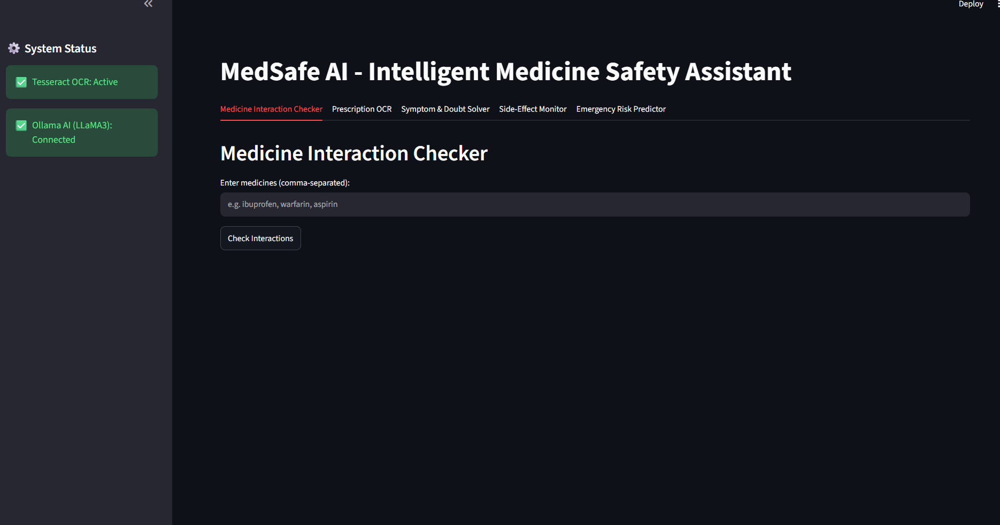
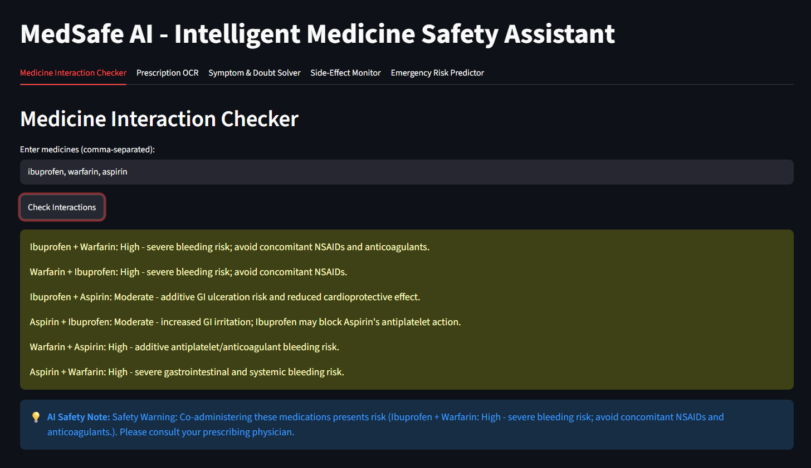
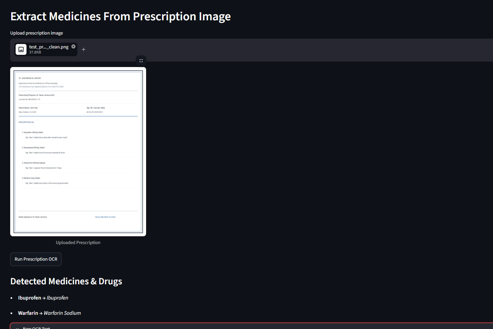
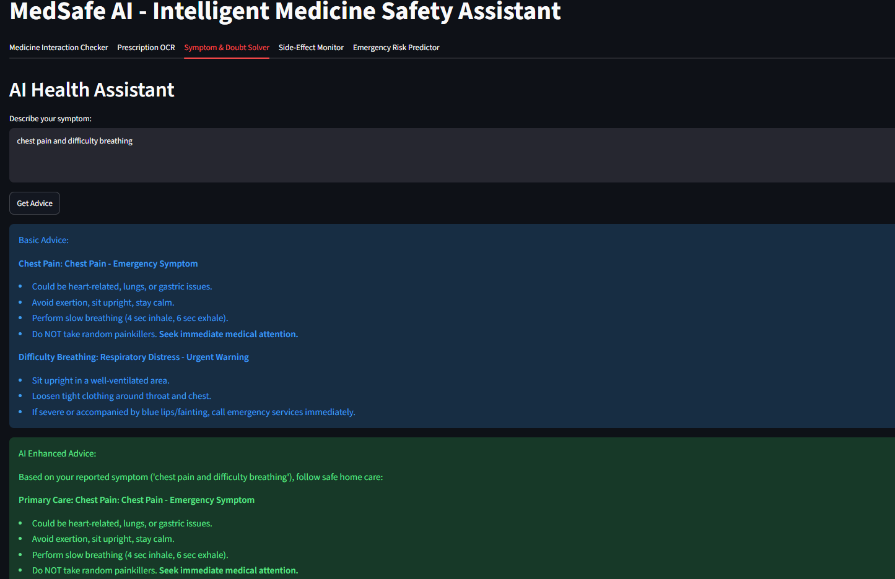
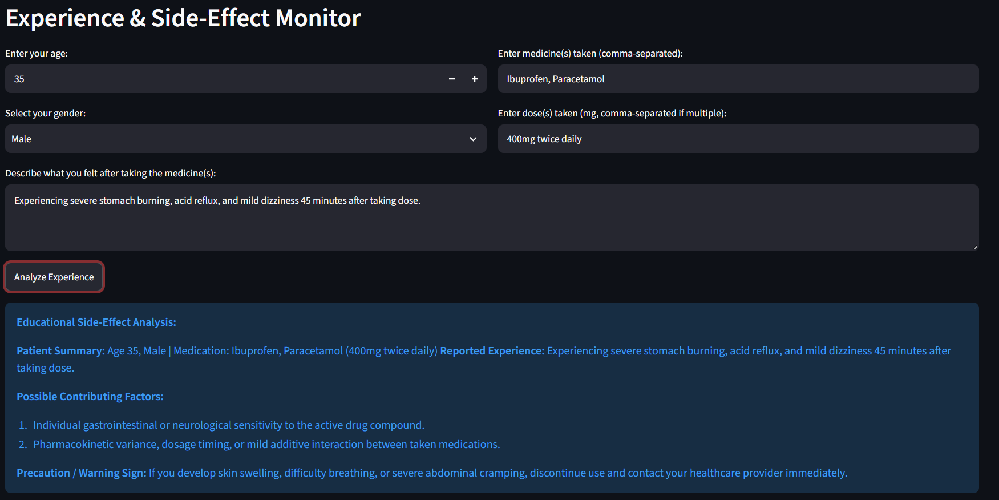
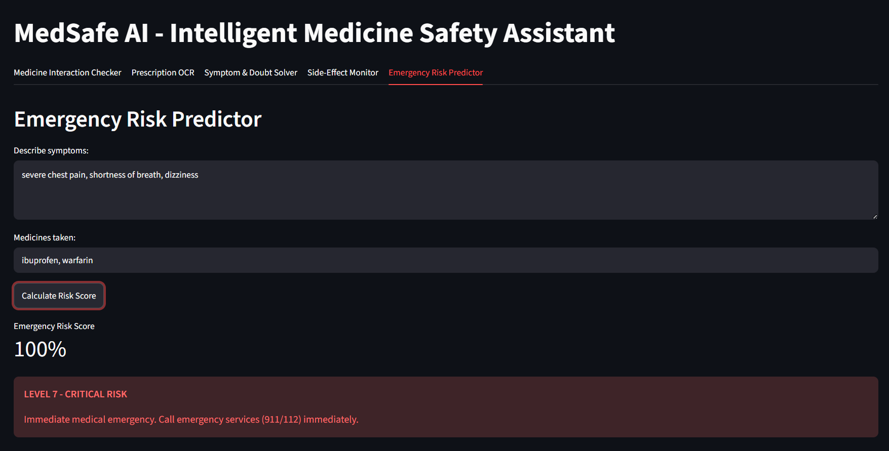

# 🏥 MedSafe AI — Intelligent Medicine Safety & Clinical Guidance Platform


-brightgreen)

**MedSafe AI** is an intelligent healthcare safety assistant built with **Streamlit**, **RapidFuzz**, **Tesseract OCR**, and **Ollama (LLaMA3)**. It provides real-time prescription OCR parsing, pairwise drug-drug interaction detection, symptom guidance, side-effect monitoring, and emergency risk prediction.

---

## 🎥 Project Demo Video

Watch the full platform walkthrough and live workflow demonstration:

[▶️ Watch Project Demo Video (`video demo.mp4`)](video%20demo.mp4)

---

## 📸 Visual Showcase & Screenshots

Place your screenshot files into the [`assets/screenshots/`](assets/screenshots/) folder using the filenames below to automatically render them in this README!

### 1. 🏥 Dashboard Overview & System Status
> *Main interface displaying system status for Tesseract OCR and Ollama AI connection.*



---

### 2. 💊 Medicine Interaction Checker
> *Pairwise drug-drug interaction detection across multiple medications with RapidFuzz matching & AI safety notes.*



---

### 3. 📄 Prescription OCR & AI Parsing
> *Prescription image upload preview, OCR raw text extraction, and structured medicine/drug salt JSON parsing.*



---

### 4. 🩺 Symptom & Doubt Solver
> *Rule-based emergency symptom advice expanded with LLaMA3 home remedies, breathing exercises, diet tips, and warning signs.*



---

### 5. 🔴 Experience & Side-Effect Monitor
> *Patient context collection (Age, Gender, Medicines, Dosage, Experience) and educational AI side-effect review.*



---

### 6. 📊 Emergency Risk Predictor
> *Numeric emergency risk percentage score ($10\%$ to $100\%$) mapped to visual severity alert levels (Level 7 Critical, Level 5 High, Level 1 Minimal).*



---

### 7. 🧪 Automated Unit Test Suite Output
> *Execution of 8 automated unit tests verifying pairwise checking, fuzzy matching, symptom triage, and fallback paths.*


---

## 🌟 Key Features

| Tab | Feature | Technical Capability |
|---|---|---|
| **Tab 1** | **💊 Medicine Interaction Checker** | Evaluates **pairwise drug-drug interactions** ($N \times N$) across all entered drugs using RapidFuzz matching and generates 1-sentence LLaMA3 AI safety summaries. |
| **Tab 2** | **📄 Prescription OCR & AI Parsing** | Reads uploaded prescription images using Tesseract OCR, parses active drugs/salts into strict JSON, and falls back to local fuzzy matching if offline. |
| **Tab 3** | **🩺 Symptom & Doubt Solver** | Identifies rule-based emergency symptoms (chest pain, shortness of breath, fever) and expands advice with 2 home remedies, 1 breathing exercise, 1 diet tip, and warning signs via LLaMA3. |
| **Tab 4** | **🔴 Side-Effect Monitor** | Gathers patient details (Age, Gender, Medicines, Dosage, Experience) to generate educational insights on possible contributing factors and precautions. |
| **Tab 5** | **📊 Emergency Risk Predictor** | Computes a percentage emergency risk score ($10\%$ to $100\%$) and maps it to visual alerts: Level 7 Critical ($\ge 90\%$), Level 5 High ($\ge 60\%$), and Level 1 Minimal ($< 60\%$). |

---

## 📂 Project Architecture & Folder Structure

```
c:\Users\kolan\OneDrive\Desktop\med\
├── main.py               # Streamlit 5-tab application & user workflow orchestration
├── med_db.py             # Curated drug database, RapidFuzz matcher & pairwise checker
├── symptom.py            # Rule-based symptom advice, side-effect monitor & risk calculator
├── test_medsafe.py       # Automated unit test suite (8 test cases)
├── requirements.txt      # Pinned Python package dependencies & Tesseract setup note
├── video demo.mp4        # Project demonstration video (Git LFS tracked)
├── er_diagram.html       # Interactive 10-Entity Entity-Relationship Diagram
├── roadmap.html          # Interactive Project Roadmap (4 Epics, 12 Stories)
├── walkthrough.md        # Detailed feature test verification report
├── README.md             # Project documentation & setup guide
└── assets/
    └── screenshots/      # Application screenshots folder
        ├── dashboard_overview.png
        ├── interaction_checker.png
        ├── prescription_ocr.png
        ├── symptom_solver.png
        ├── side_effect_monitor.png
        ├── risk_predictor.png
        └── unit_tests.png
```

---

## 🚀 Quick Start & Installation

### 1. Prerequisites
- **Python 3.9+** installed on your system.
- **Tesseract OCR Engine**:
  - Windows: Install via `winget install UB-Mannheim.TesseractOCR` or download from [UB-Mannheim Tesseract](https://github.com/UB-Mannheim/tesseract/wiki).
  - Default installation path: `C:\Program Files\Tesseract-OCR\tesseract.exe`.
- *(Optional)* **Ollama Runtime**: Download from [ollama.com](https://ollama.com) and pull `LLaMA3` model:
  ```bash
  ollama run LLaMA3
  ```

---

### 2. Setup Virtual Environment & Dependencies

```bash
# Clone the repository
git clone https://github.com/rakeshk246/medsafe.git
cd medsafe

# Create virtual environment
python -m venv medsafe_env

# Activate virtual environment (Windows PowerShell)
.\medsafe_env\Scripts\activate

# Install dependencies
pip install -r requirements.txt
```

---

### 3. Launch the Application

```bash
streamlit run main.py
```
Open your browser and navigate to **`http://localhost:8501`**.

---

## 🧪 Running Automated Unit Tests

Run the full automated test suite covering all features and LLM fallback paths:

```bash
python -m unittest -v test_medsafe.py
```

### **Test Results Output**
```text
test_analyze_side_effects_fallback (test_medsafe.TestMedSafeEngine) ... ok
test_check_interactions_pairwise (test_medsafe.TestMedSafeEngine) ... ok
test_find_medicine_exact_and_fuzzy (test_medsafe.TestMedSafeEngine) ... ok
test_llama_expand_fallback (test_medsafe.TestMedSafeEngine) ... ok
test_llama_short_warning_fallback (test_medsafe.TestMedSafeEngine) ... ok
test_risk_score_calculation (test_medsafe.TestMedSafeEngine) ... ok
test_symptom_advice_emergency_detection (test_medsafe.TestMedSafeEngine) ... ok
test_unknown_medicine_reporting (test_medsafe.TestMedSafeEngine) ... ok

----------------------------------------------------------------------
Ran 8 tests in 0.008s

OK
```

---

## 🎨 Interactive Visual Artifacts

- **[er_diagram.html](er_diagram.html)**: Interactive 3NF Normalized ER Diagram covering 10 core entities (User Profile, Session, Prescription OCR, Medicine Item, Interaction Check, Symptom Input, Side Effect Monitor, Risk Assessment, AI Explanation, Log Entry).
- **[roadmap.html](roadmap.html)**: Interactive Agile Roadmap covering 4 Epics and 12 Stories across sprint phases.

---

## ⚠️ Medical Disclaimer

*MedSafe AI is an educational and informational tool designed to assist with medication safety awareness and symptom guidance. It does NOT provide formal medical diagnosis or replace professional clinical judgment. Always consult a licensed physician or pharmacist for medical emergencies and prescribing advice.*

---

## 📄 License
Licensed under the [MIT License](LICENSE).
